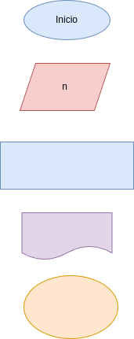

# programa 3 para invertir numero
programa en python para invertir un numero

## Analisis 

### Variables de entrada
- n: numero de 4 digitos 

### Procesamiento 
- r4 = ultimo digito
- r3 = tercer digito
- r2 = segundo digito
- r1 = primer digito 
- ni = el numero invertido

r4 = n%10
r3 = (n//10)%10
r2 = (n//100)%10
r1 = (n//1000)%10

ni = r4*1000 + r3*100 + r2*10 + r1

## Diseño

## construccion
- codigo implementado en repositorio_para_ invertir_un_numero.py
